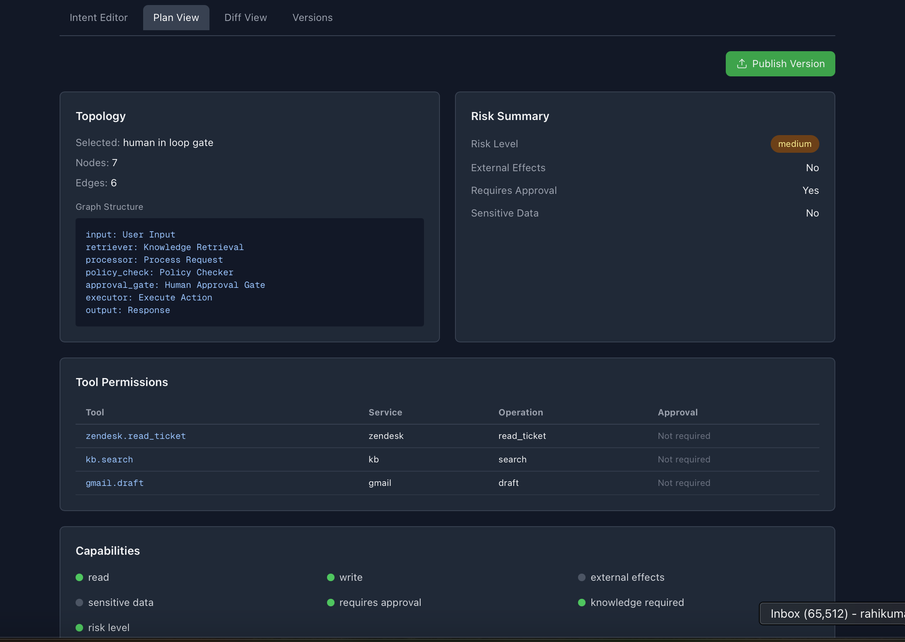

# AI Things I'm building

    

        
    

    

        <h3 class="mywork-title">
            <a 
            <a href="https://github.com/thetpmguy/rag-as-a-service" class="mywork-link">
            RAG as a Service
            </a>
        </h3>
   
Rahi Kumar

 

            <a href="https://github.com/thetpmguy/rag-as-a-service" class="tag tag-github">GITHUB</a>
     <a href="https://thetpmstory.substack.com/p/how-rag-actually-works-and-the-rag" class="tag tag-github">SUBSTACK</a>
        

    

    

        
    

    

        <h3 class="mywork-title">
            <a 
            <a href="https://github.com/thetpmguy/agent-compiler" class="mywork-link">
            Agent Compiler:Design-time governance for AI agents
            </a>
        </h3>
   
Rahi Kumar

    

            <a href="https://github.com/thetpmguy/agent-compiler" class="tag tag-github">GITHUB</a>
        

    

    

    

        
    

    

        <h3 class="mywork-title">
            <a 
            <a href="https://github.com/thetpmguy/Decision-Ledger-using-multi-agents" class="mywork-link">
            Decision Ledger using multi-Agents
            </a>
        </h3>
   
Rahi Kumar

      

            <a href="https://github.com/thetpmguy/agent-compiler" class="tag tag-github">GITHUB</a>
        

    

